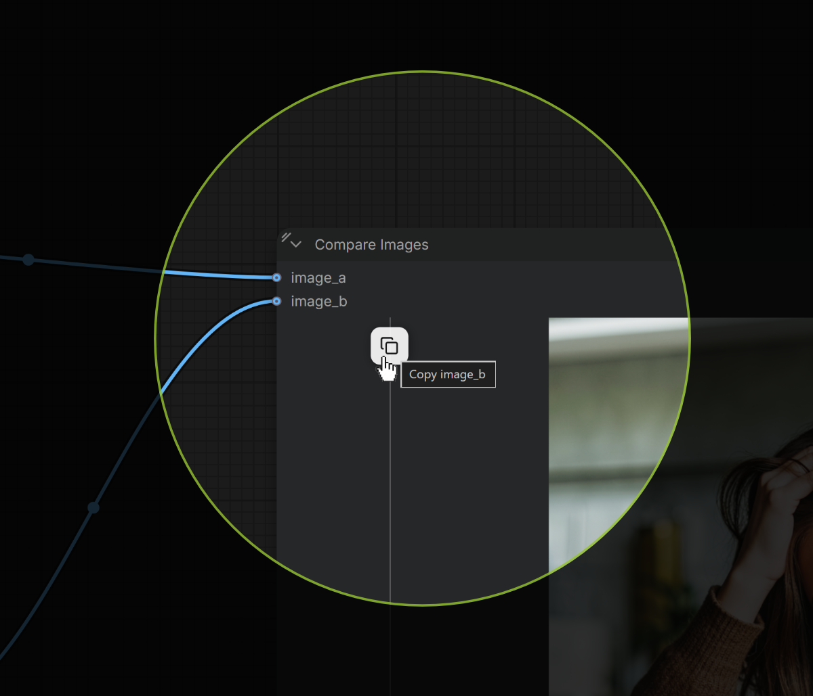

# Compare Copy Buttons

Adds a **Copy to clipboard hover button** to the default "Compare Image" node.

## Install

Drag this repo's `comfy-compare-copy-buttons` folder into `ComfyUI/custom_nodes/`
so it ends up as `ComfyUI/custom_nodes/comfy-compare-copy-buttons/`, then restart
ComfyUI. That folder contains only what the node needs — nothing else to edit.

> Important: the folder name must not contain spaces. The ComfyUI frontend
> requests the extension script at
> `/extensions/<folder-name>/js/compare_copy_buttons.js`, and a space in the
> folder name makes that request return 404 — the extension loads but its
> JavaScript never runs (no copy button appears).
