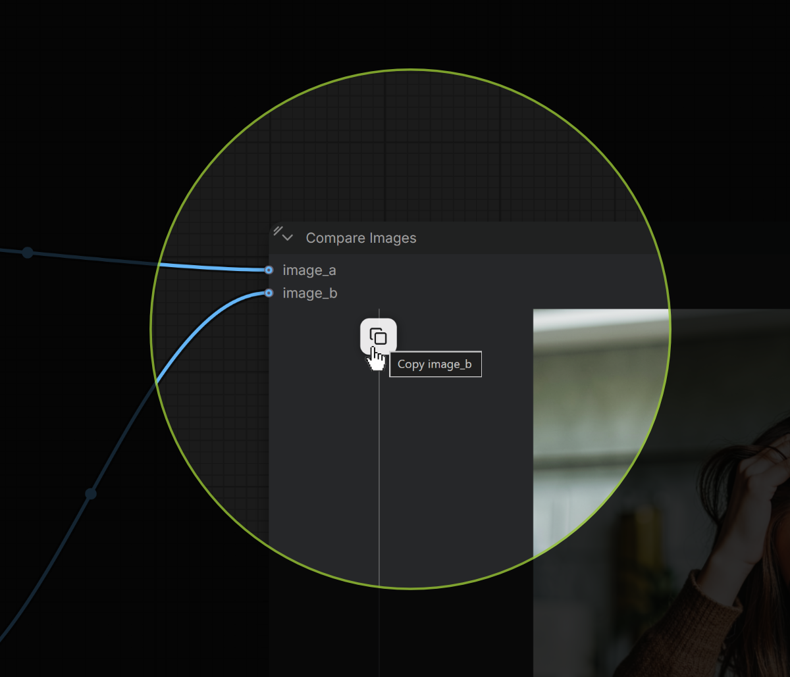

# Compare Images + Copy Buttons

Adds a **Copy to clipboard hover button** to the default "Compare Image" node,
plus a small caption under the image showing its size and transparency.

## Info line

Under the compare view each side is listed with its pixel size and whether that
image really contains transparent pixels, for example
`image_a 1024×1024 · alpha: yes   image_b 512×512 · alpha: no`.
The two names are the node's own inputs (`image_a` is the before image,
`image_b` the after image). Hover a side for the same information as a
tooltip. `alpha: unknown` means the browser would not let the page read the
pixels (a cross-origin image).

## Install

Drag this repo's `comfy-compare-copy-buttons` folder into `ComfyUI/custom_nodes/`
so it ends up as `ComfyUI/custom_nodes/comfy-compare-copy-buttons/`, then restart
ComfyUI.
